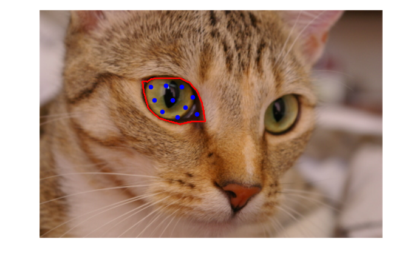

# maskSLIC
Simple linear iterative clustering (SLIC) in a region of interest

## Development
This code is still a work in progress. The following issues still need to be resolved:
[] Fix for calculating mean distance between points to improve compactness calculation (in progress)
[] Fix the enforce connectivity method to work with maskSLIC

## Outline
This code demonstrates the adaption of SLIC for a defined region of interest. 
The main contribution is in the placement of seed points within the ROI. 

The code is a modification of the SLIC implementation provided by Scikit-image (http://scikit-image.org/)

An online demo is available at: http://maskslic.birving.com/index

An outline of the method is available at: http://arxiv.org/abs/1606.09518

Figure 1: An example region and the automatically placed seed points using this method. 

Figure 2: The final superpixel regions within the ROI

